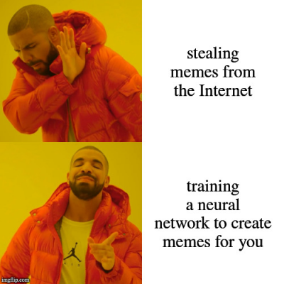
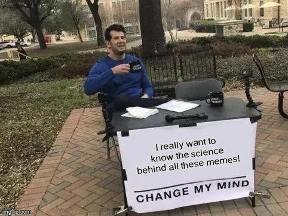

# (WIP) Neural Meme Generator

The goal of this project is to train a neural network that can generate 
(probably unfunny) captions to the most popular images, within their respective "styles".

Why? Because why not.

## Requirements

This project is written in Python 3.8, using Tensorflow 2.2.

## Model architecture

(This is an actual caption generated by the model).

The model uses a pre-trained DistilGPT-2 from [huggingface/transformers](https://github.com/huggingface/transformers) as a basis for fine-tuning.
Based on over 40 most common image templates, it tries to generate a new caption to a submitted template.

## Sources

My inspiration was [an article by Dylan Wenzlau](https://towardsdatascience.com/meme-text-generation-with-a-deep-convolutional-network-in-keras-tensorflow-a57c6f218e85) on Medium.

I am be using images from [imgflip.com](https://imgflip.com/).
