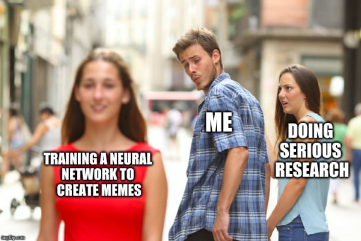

# (WIP) Neural Meme Generator

 

The goal of this project is to train a neural network that can generate 
(probably unfunny) captions to the most popular images, within their respective "styles".

Why? Because why not.

## Requirements

This project is written in Python 3.8.

## Sources

My inspiration was [an article by Dylan Wenzlau](https://towardsdatascience.com/meme-text-generation-with-a-deep-convolutional-network-in-keras-tensorflow-a57c6f218e85) on Medium.

I will be using images from [imgflip.com](https://imgflip.com/).
